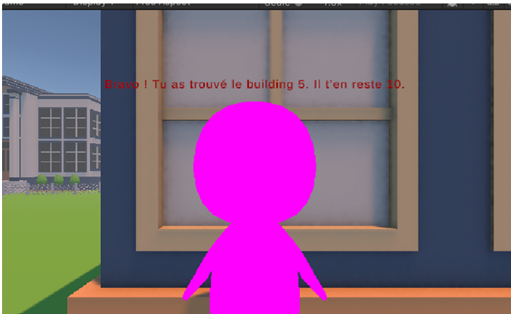

###  Collaborative 3D Data Visualization Workspace

---

##  Project Overview

* This multiplayer Unity app uses Photon PUN to create a shared 3D city environment where users take on one of two roles:

  **Analyst:** navigates and scans buildings using Raycast, sending building ID and population data via PhotonView\.RPC
  **Visualizer:** receives and displays the real-time data from Analysts

* All player movements and data sharing are synchronized smoothly with PhotonTransformView and RPC calls, enabling real-time collaborative data analysis in a shared space.

---

##  Roles & Features

---

# Analyst

* Move freely through the city
* Scan buildings with Raycast to gather ID and population info
* Send scanned data to other clients

---

# Visualizer

* Receive and display data in real-time
* Visualize population info from Analysts’ scans

---

##  Interface & Visualization

---

# Scene Overview

Voici une image représentant la scène 3D dans Unity où se déroule la collaboration :

```markdown

```

---

### ### Analyst Interface

Interface utilisée par le rôle Analyst pour naviguer et scanner les bâtiments :

```markdown

```

---

### ### Visualizer Interface

Interface du Visualizer affichant les données reçues en temps réel :

```markdown

```

---

### ## Technologies & Tools

* Unity
* C#
* Photon PUN for multiplayer networking

---

### ##  How to Run

1. Clone the repository
2. Open the project in Unity
3. Build and run the project
4. Choose your role and start collaborating

---

### ## Project Structure (extrait)

* `Assets/` – Contient les scripts, scènes et ressources Unity
* `Packages/` – Packages Unity
* `ProjectSettings/` – Paramètres du projet Unity

---


